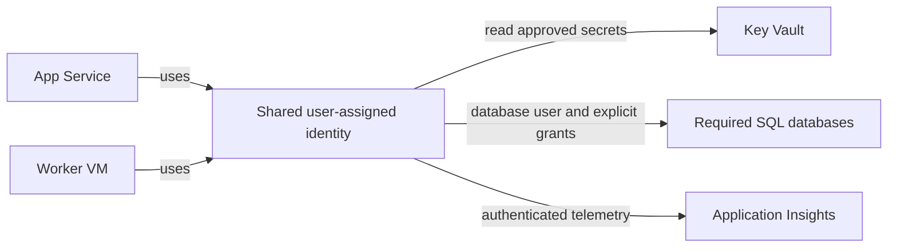

# Shared runtime managed identity

## Design

Create or reuse one user-assigned managed identity per environment, in the application's resource group. Attach it to both App Service and the worker VM. Both workloads authenticate to their dependencies as this shared principal. User-assigned identities support assignment to multiple Azure resources. [Microsoft identity overview](https://learn.microsoft.com/en-us/entra/identity/managed-identities-azure-resources/overview)

Identity supplies authentication. Each target also needs explicit authorization and working network connectivity. These are workload-to-service access relationships, not automatic connections between every resource. The App Service Plan, NICs, disks, network, and Log Analytics workspace do not need broad runtime access grants merely because they are in the same group.

Because web and worker share a principal, each can exercise all permissions granted to that principal. Treat them as one trust boundary. Separate identities can be introduced later if they need different privileges.

## Input and output

The environment file provides `MANAGED_IDENTITY_MODE`, `MANAGED_IDENTITY_NAME`, and `MANAGED_IDENTITY_ID`. `Create`, `Existing`, and `Auto` follow the same rules as other resources. Reject identities in a different tenant, subscription, or resource group. Resolve identifiers from Azure rather than asking operators to copy three unrelated values.

Export these non-secret fields under `resources.managedIdentity` in the deployment manifest:

| Field | Use |
| --- | --- |
| `resourceId` | Attach the identity to compute; configure App Service vault references |
| `clientId` | Explicitly select the intended user-assigned credential in supported SDKs/drivers |
| `principalId` | Assign roles to the backing service principal and verify database mappings |

Record the attached identity resource ID for web and worker. Validate that all IDs still refer to the same identity before local releases. A recreated identity can have the same resource ID/name but new client/principal IDs; report stale bindings instead of accepting them.

## Access configuration

| Target | Planned configuration |
| --- | --- |
| App Service | Attach the shared identity, preserve existing identities, explicitly select it in the application's credential configuration |
| Worker VM | Attach the same identity, preserve existing identities, explicitly select it in the worker's supported credential implementation |
| Key Vault | For an RBAC-enabled vault, grant Key Vault Secrets User at the intended vault scope for application secret reads; no secret-management permissions by default |
| Each required SQL database | Provision a database principal for the identity and grant only the configured runtime operations; no default db_owner or migration privileges |
| Application Insights | Grant Monitoring Metrics Publisher on the specific Application Insights resource for supported Entra-authenticated telemetry ingestion |

For App Service Key Vault references, set `keyVaultReferenceIdentity` to the identity's **resource ID**. The VM worker retrieves secrets through its own supported credential/SDK. For existing access-policy vaults, preserve the authorization model and implement equivalent explicitly scoped secret permissions if supported by the chosen configuration path. Do not switch a vault to RBAC silently. [Key Vault references](https://learn.microsoft.com/en-us/azure/app-service/app-service-key-vault-references)

SQL setup depends on the selected SQL product and driver. For the provisional Azure SQL Database design, verify Entra administration, create the identity's database user in each required database, and configure token-based application connections. Azure RBAC alone does not grant SQL query access. Record object/schema permissions or approved database roles per database before access setup can be marked ready. [Configure SQL Entra authentication](https://learn.microsoft.com/en-us/azure/azure-sql/database/authentication-aad-configure)

If automated SQL principal creation requires a server identity with directory lookup permissions, configure that as a separate SQL platform prerequisite. Do not grant directory permissions to the shared web/worker identity simply to bootstrap database users. Migration and bootstrap permissions belong to the deployment identity. [SQL service principal setup](https://learn.microsoft.com/en-us/azure/azure-sql/database/authentication-aad-service-principal)

Application Insights requires supported SDK/agent credential configuration as well as the role grant. Verify the web/worker runtime supports Entra-authenticated ingestion before disabling local authentication. Browser telemetry and some instrumentation paths do not support this flow. Do not assume a general application environment variable configures every telemetry library. [Application Insights authentication](https://learn.microsoft.com/en-us/azure/azure-monitor/app/azure-ad-authentication)

## Implementation and release rules

1. Resolve/create the resource group and identity before attaching the identity to compute.
2. Keep identity resource creation in `ManagedIdentity.psm1`; attachment, runtime selection, role grants, and SQL user setup belong to `AccessAndConfiguration.psm1`.
3. Treat attachments to reused compute as explicit configuration changes inside Provisioning.ps1. Preserve unrelated user-assigned identities and any existing system-assigned identity. Deployment.ps1 checks attachments and permissions without repairing them.
4. Scope role grants to required target resources. Reconcile by principal, role definition, and scope; preserve unrelated grants. Handle propagation with bounded retries.
5. Require the provisioning operator to have identity creation/assignment rights, target configuration rights, and applicable role-assignment permissions. Validate database bootstrap rights separately. Never grant Owner/Contributor on the whole group to the runtime identity as a shortcut.
6. Verify token-based dependency access from both actual hosts, including each configured database. Do not log access tokens. A deployment operator's successful request does not prove the application identity has access.
7. Publish target readiness only after attachments, permissions, runtime configuration, and connectivity are verified.

The local deployment script signs in using an authorized operator or deployment service principal. The shared identity authenticates workloads hosted in Azure; its client ID in the output manifest is not a credential that a developer's laptop can use to impersonate it.

Identity creation, attachment, role assignments, and SQL grants are implemented. They have not been executed against a live Azure environment in this repository session.
